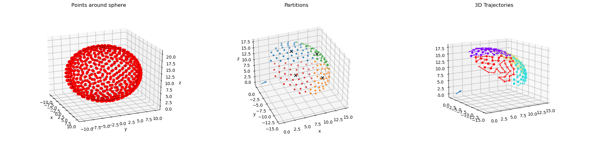

# Swarm-Sphere-Coverage
Swarm Sphere coverage path planning for ORSwarm project.

## Description
The objective is to measure antenna performance using a swarm of drones.
This algorithm is meant to generate waypoints that guarantee complete coverage of a sphere or a portion of a sphere. A trajectory for each drone is then generated, guaranteeing that all waypoints are visited once.   

### Parameters

- ***Sphere radius [m]***: radius of the sphere built around the antenna.

- ***Antenna direction [rad]***: set of angles that defines the antenna's direction.

- ***Distance from antenna [m]***: distance in the antenna directione at which the sphere intersects an imaginary plane (used to define the sphere partitions). If it is set to 0, then the entire sphere will be covered.

- ***Points per squared meters [m2]***: waypoints density, it defines how many waypoints will be generated per squared meter on the sphere surface.

- ***Numbers of drones***: number of drones used in the task.

## Procedure

1. Spawn a certain number of points around a sphere (based on the sphere radius and the waypoints' density).

2. Only the waypoints above the plane defined by the distance from the antenna are considered.

3. The resulting waypoints are then clustered and assigned to the drones use (using K-Means algorithm).

4. For each set of waypoints, a TSP solver is used to find a trajectory that each waypoint is visited only once.
